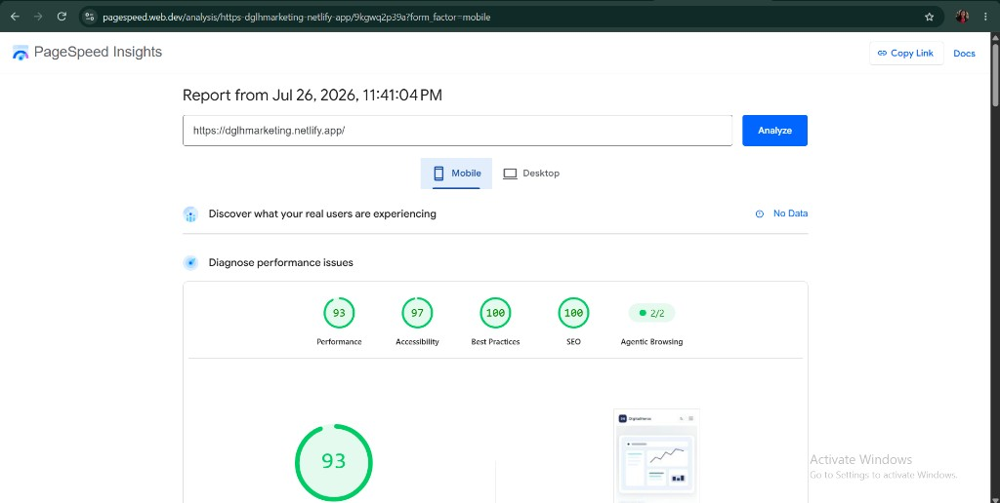
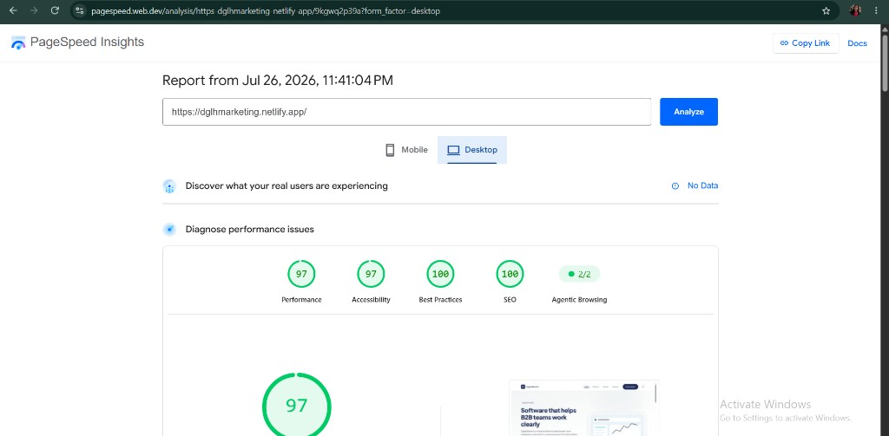

# DigitalHeros Marketing Site

Multi-page marketing site for a B2B software company. Built with **React + Vite** and CSS — no page builders.

## Deliverables

| Item | Link |
|------|------|
| **Live site** | [https://dglhmarketing.netlify.app/](https://dglhmarketing.netlify.app/) |
| **Public GitHub repo** | [github.com/Anjali17aj/dglhmarketing-site](https://github.com/Anjali17aj/dglhmarketing-site) |
| **PageSpeed Insights** | [Report (Desktop)](https://pagespeed.web.dev/analysis/https-dglhmarketing-netlify-app/9kgwq2p39a?form_factor=desktop) · [Report (Mobile)](https://pagespeed.web.dev/analysis/https-dglhmarketing-netlify-app/9kgwq2p39a?form_factor=mobile) |

## Pages

| Page | Route | Structured data |
|------|-------|-----------------|
| Home | `/` | Organization |
| Product | `/product` | Organization + SoftwareApplication |
| Pricing | `/pricing` | Organization + FAQPage |
| Contact | `/contact` | Organization |

## Performance & Core Web Vitals

PageSpeed Insights (Lighthouse) results for the production homepage — **Jul 26, 2026**.

| Form factor | Performance | Accessibility | Best Practices | SEO |
|-------------|-------------|---------------|----------------|-----|
| **Mobile** | **93** (green) | 97 | 100 | 100 |
| **Desktop** | **97** (green) | 97 | 100 | 100 |

**Evidence screenshots**





**Live report:** [pagespeed.web.dev analysis](https://pagespeed.web.dev/analysis/https-dglhmarketing-netlify-app/9kgwq2p39a?form_factor=desktop)

### How we hit green Core Web Vitals

- **Fast first paint / LCP:** SVG hero as LCP candidate, `fetchpriority="high"` + preload; page transition starts visible so opacity does not delay LCP
- **Lean JS:** React Router code-splitting (`lazy` routes), vendor chunk split, no page-builder or heavy UI kits
- **Fonts without blocking:** Google Fonts preconnect + non-blocking stylesheet (`media="print"` → `onload`)
- **CSS:** Hand-written tokens + critical layout CSS; no unused CSS frameworks
- **Images:** Lightweight SVGs for hero/product art instead of large bitmaps
- **Motion:** Scroll reveals respect `prefers-reduced-motion`

## Schema & meta evidence

- **Organization** JSON-LD on every built HTML page
- **SoftwareApplication** (Product/Service) on `/product`
- **FAQPage** on `/pricing`
- Per-route **title, description, canonical, Open Graph, and Twitter** tags injected at build time via `vite.seo-plugin.js` + `src/seo/siteMeta.js` (crawlers do not need client JS)
- Validate with [Google Rich Results Test](https://search.google.com/test/rich-results) or View Source on each route

## Quick start

```bash
npm install
npm run dev
```

Open [http://localhost:5173](http://localhost:5173).

```bash
npm run build    # production build → dist/
npm run preview  # preview the production build
```

## Project structure

```
docs/evidence/    # PageSpeed / performance screenshots
public/           # Static assets (favicon, SVGs, OG image)
src/
  components/     # Layout, sections, and shared UI
  content/        # JSON copy (edit marketing text here)
  context/        # Theme provider (light / dark)
  hooks/          # Animation helpers
  pages/          # Route-level page composition
  seo/            # Meta tags + JSON-LD builders
  styles/         # Design tokens, global CSS, animations
vite.seo-plugin.js  # Injects SEO into built HTML per route
```

**Content separation:** Marketing copy lives in `src/content/*.json`. Pages read JSON and render through shared components, so a content team can extend copy without touching layout code.

| File | Purpose |
|------|---------|
| `site.json` | Company name, URL, contact, social links |
| `home.json` | Home hero, features, lifecycle, CTAs |
| `product.json` | Product page copy + SoftwareApplication schema |
| `pricing.json` | Plans, FAQs |
| `contact.json` | Contact page copy |
| `testimonials.json` | Customer quotes |

## Features

- Light / dark theme with system preference detection and persistent toggle
- Scroll reveals, page transitions, and staggered section motion
- Responsive layout with skip link, semantic landmarks, and keyboard-friendly nav
- Build-time SEO: unique title, description, canonical, Open Graph, and Twitter tags per route
- JSON-LD (Organization, SoftwareApplication, FAQPage) written into static HTML

## Accessibility

- Semantic landmarks: `header`, `nav`, `main`, `footer`, `section`
- One `<h1>` per page with logical heading order
- Skip link to `#main-content`
- Keyboard-navigable menu (focus trap, Escape) and visible `:focus-visible` styles
- Form labels linked with `htmlFor`, `aria-invalid` / `aria-describedby` on errors
- Images include descriptive `alt` text

## Tech stack

- React 19
- Vite 7
- React Router 7
- Plain CSS (design tokens in `src/styles/tokens.css`)

## License

MIT — fictional company for portfolio / assessment use.
